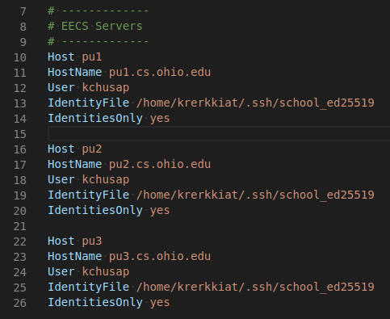
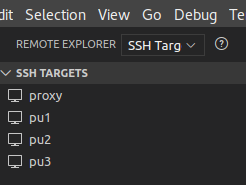

# CS3560 - Example Project

Example project that uses Doxygen, Makefile, Catch2, Travis CI.

This is a simple project that contain some of the tools used in the class. For example,

- .gitignore
- Git with commit message in Commitizen convention ([https://commitizen.github.io/cz-cli/](https://commitizen.github.io/cz-cli/)).
- Makefile
- Doxygen with Netlify
- Catch2
- Travis CI (The idea of integrating this into class is heavily influenced by Mr. Robert Foreman).
- maybe Google Test Framework (using Docker image)

## Git with commit message in Commitizen convention

Some of commit message in this repository are following the Commitizen convention
([https://commitizen.github.io/cz-cli/](https://commitizen.github.io/cz-cli/)).

## Doxygen with Netlify

The `fib` example contains configuration of [Doxygen](http://www.doxygen.nl/) (`fib/Doxygfile`) and [Netlify](https://www.netlify.com/) (`netlify.toml`)
that automatically build doxygen (using `cd fib && make doc`), and publish the generated document
to [https://ou-cs3560-examples.netlify.com/](https://ou-cs3560-examples.netlify.com/).

## Connect to school servers

### How to connect to 3rd Floor Linux Computers from 1st Floor Windows Lab computers

Type in WINDOWS-R, then type in "cmd" in the dialog box.

In the window with the command prompt, do the following:

```
C:\Users\Chang Liu>ssh changliu@pu1.cs.ohio.edu
The authenticity of host 'pu1.cs.ohio.edu (132.235.1.15)' can't be established.
ECDSA key fingerprint is SHA256:PCIKPlKu35MHGF+zSgDUbEvFRNDN8vapyp7lYVI+O8Q.
Are you sure you want to continue connecting (yes/no)? yes
Warning: Permanently added 'pu1.cs.ohio.edu,132.235.1.15' (ECDSA) to the list of known hosts.
changliu@pu1.cs.ohio.edu's password:


      NEW SERVER CONFIGURATION:

  pu1.cs.ohio.edu has the same configuration as the machines in
  room 307, including tesla video card. Using this machine remotely
  instead of one of the ones in 307 for graphics will avoid
  conflicts with anyone logged in at the workstation.

   pu2.cs.ohio.edu is a nice 16 core ubuntu server with an Intel Xeon CPU
   with 2 threads per core, and  24 gigs of ram

   pu3.cs.ohio.edu  is a very nice ubuntu server with an AMD 32 core
   Processor, 2 treads per core, and 32 gig of ram.


   p1.cs.ohio.edu  and p2.cs.ohio.edu
   are Sun Sparc cpu based machines that run Solaris 10.

   px1.cs.ohio.edu is an x86 based machine running ubuntu.

   tesla2.cs.ohio.edu is an x86 with 2 nvidia cards, one of
   which is a tesla card

   The Solaris machines are nice to check the execution of your
   programs on as the different architectures often expose
   bugs you would not normally see.

  RATHER THAN SSH INTO A WORKSTATION IN THE LABS , PLEASE USE OUR SERVERS.
Last login: Wed Nov 20 13:25:21 2019 from 74.113.47.217
.bash_profile executed.
changliu@pu1:~$ which doxygen
/usr/bin/doxygen
changliu@pu1:~$ doxygen
error: Doxyfile not found and no input file specified!
Doxygen version 1.8.13
...
```
pu[1-3].cs.ohio.edu are the preferred remote servers. odd[?].cs.ohio.edu are the workstations in the 3rd floor lab. If you don't know your user name and password, contact Mr. John Tysko.

### Connect via vscode

By using the extension call Visual Studio Code Remote Development [https://code.visualstudio.com/docs/remote/remote-overview](https://code.visualstudio.com/docs/remote/remote-overview), you can use vscode on your laptop (or from PC in the classroom; see the first extra note) to edit a file on school server.

You will also have access to GUI for git that vscode has as well. But do not forget to still study which Git command do what since this class is focusing on that.

To have a better experience, you will have to use SSH key authentication where you are not require to type password every time you are logging to the school server. Please see this article for how to do it: [https://www.digitalocean.com/community/tutorials/how-to-configure-ssh-key-based-authentication-on-a-linux-server](https://www.digitalocean.com/community/tutorials/how-to-configure-ssh-key-based-authentication-on-a-linux-server)

This is what I usually have in my ~/.ssh/config for the school server.



Then in the extension you will see the list of SSH target.



Then you can connect to the school server and edit file there from vscode.